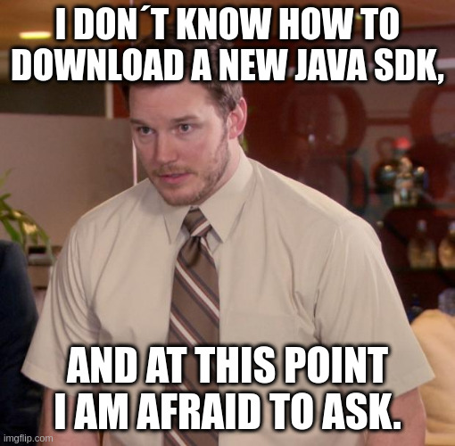

# 00.010 Introduction

* People have a variety of backgrounds in Java
* People have forgotten Java
* Objective is to get everyone to a common starting point
* It is easy to miss some basic point, and, at this point you are afraid to ask.  Please don´t be afraid to ask. 

## Use

* Review at the start of the course
* A point students can go back to review specific topics.

These notes are at [https://github.com/noynaert/csc346handouts](https://github.com/noynaert/csc346handouts)

## Which Java?

We need a Java Development Kit (JDK).  Note that this is different than the Java Runtime Environment (JRE).

You will probably need to update your version.  You may figure out what you have with the following commands:

```bash
   java   --version
   javac  --version
```

### Which Distribution?

* Oracle JDK 
* OpenJDK
* RedHat JDK

### Which Version?

Use of "Long Term Support" or LTS versions are recommended for Java development.

It is possible to have more than one version of Java on your system.  This is by design.  But it is important to make sure you IDE is using the version you intend to use.

### Minimum version for CSC 346

* Use of a LTS version is recommended
* We will be using features not added until Version 11
* Version 21 LTS is recommended.  Version 17 LTS is the minimum.

#### Updating Java 

You should be able to install a new version of the JDK and leave the old system in place.  

Be sure to use the following commands to make sure your system is using the most recent version of Java.

```bash
   java   --version
   javac  --version
```

# Set environmental variables  

I had to add these manually to my ~/.profile

For Linux, the `update-alternatives` command will change the default version of Linux.

sudo update-alternatives --config java  # Then pick the jdk-21 option
sudo update-alternatives --config javac # Then pick the jdk-21 option

For windows, it is probably better to use the `update-java-alternatives` program that is part of the Java package itself.  

### Update environmental variables
You may need to update environmental variables.  In most cases the IDE will take care of these for you.  But some operations such as Maven may require them.

You may either modify these environment variables now, or just wait until there is a problem that you need to fix.  

### Reboot???

Linux and Mac systems should respond properly after running update-alternatives. A reboot is one way to fix the environment variables.  Windows should probably be rebooted after running update-java-alternatives or changing environment variables.

- JAVA_HOME
- CLASSPATH
- PATH

# test versions
```bash
javac --version
java --version
echo $JAVA_HOME
```

You may want to logoff and back on to make sure your preferred version survives.
