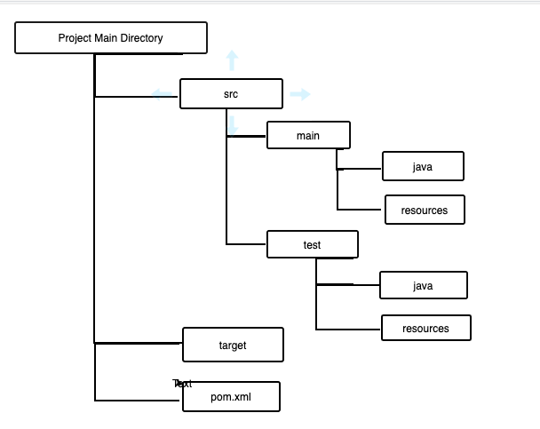

# 01.040 Maven

## References

* [https://medium.com/gradeup/introduction-to-apache-maven-automation-tool-for-projects-ca1533730198](https://medium.com/gradeup/introduction-to-apache-maven-automation-tool-for-projects-ca1533730198)
* [Video about Maven](https://www.youtube.com/watch?v=28fsqKNjxrc)
* [Changing versions, options](https://www.youtube.com/watch?v=28fsqKNjxrc)

Maven helps generate large projects.  It manages code, dependencies (usually .jar files), and resources.

## Maven is a program.  

* Produced by Apache.  [https://maven.apache.org](https://maven.apache.org/index.html)

## Repositories

Maven works in terms of repositories

* Remote -- This is usually a  central remote repository like [https://mvnrepository.com/](https://mvnrepository.com/)
  * See [https://mvnrepository.com/artifact/org.jsoup/jsoup/](https://mvnrepository.com/artifact/org.jsoup/jsoup/) as an example for jsoup
* Central -- Typically a large Java developer would have a central repo for its employees
* Local -- On the user's machine.
  * Windows: Windows: C:\Users\<User_Name>\.m2
  * Linux: Linux: /home/<User_Name>/.m2 (or `~/.m2`)
  * Mac: /Users/<user_name>/.m2 (or `~/.m2`)

## Directory structure

## The pom.xml file

* XML is used for a couple of things
  * Storing configuration data
  * Exchanging data between programs
* XML is related to HTML.
  * HTML4 was actually XML
  * Same basic rules as HTML, but we get to make up the tag names.

The POM file describes the properties and dependencies of a project.

## The ID's

### GroupID
 
* The groupid identifies a project uniquely across all project.  
* The naming schema follows the package naming convention.  (domain name backwards)  There may be as many subgroups as you wish after the domain name; some organizations have an explicit system

### ArtifactId

This is the name of the jar file without the version number.  It is the "name" of the project.

### Version number

* May be almost any system you wish to use.

## Build lifecycle of a Maven project

* **clean** -- Removes old targets
* **validate** -- All necessary information is available
* **compile** -- Compile .java files to create .class files (or equivalent in other languages)
* **test** -- Run tests using suitable unit testing framework (DevOps course covers testing)
* **package** -- In languages like C this would include linking.  It bundles the class files together
* **verify** checks to verify the package is valid.
* **install** install page to local repository for use as a dependency in other local projects
* **deploy** copies final package to a remote repository ***or*** to a release environment (for example, move a web site to the live site.)

## Archetypes

Archetypes are basic starting configurations
