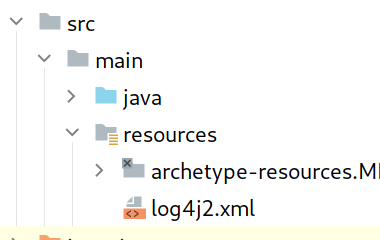

# 01.060 Log4j

* Log4j is a standard Java package.  It is nearly ubiquitous
* [Security issue](https://theconversation.com/what-is-log4j-a-cybersecurity-expert-explains-the-latest-internet-vulnerability-how-bad-it-is-and-whats-at-stake-173896)

## Safety

We will be using a version of **Log4j 2** that has had the security vulnerability disabled.

## Reference

Log4j had migrated to Log4j version 2 before the vulnerability.  This has outdated a lot of documentation and tutorials available online.

The recent changes due to the vulnerability complicate the situation even further.

The most useful and up-to-date reference I have found is [https://www.sentinelone.com/blog/maven-log4j2-project/](https://www.sentinelone.com/blog/maven-log4j2-project/)

## Implementation

* The example is in Intellij
* I have tested it with both the `edu.missouriwestern.csc346` archetype and with the `org.apache.maven.archetypes.quickstart` archetype 

## Procedure

### `pom.xml` depenencies

For both the following situations, when you include the dependencies they should appear in a reddish color in Intellij.  After you refresh maven the red should turn black if the update is successful. 


#### for the edu.missouriwestern.csc346 archetype

* The &lt;dependencies> element tag should go between the &lt;properties> and the &lt;build> tags

```xml
    <dependencies>
        <dependency>
            <groupId>org.apache.logging.log4j</groupId>
            <artifactId>log4j-api</artifactId>
            <version>2.17.0</version>
        </dependency>
        <dependency>
            <groupId>org.apache.logging.log4j</groupId>
            <artifactId>log4j-core</artifactId>
            <version>2.17.0</version>
        </dependency>
    </dependencies>
```

#### for the Apache quickStart archetype

* If you are using the quickStart archetype you should already have a &lt;dependencies> entry with junit as a dependency.  
* Copy the following two dependencies after (or before) the existing dependency. 

```xml
<dependency>
     <groupId>org.apache.logging.log4j</groupId>
     <artifactId>log4j-api</artifactId>
            <version>2.13.0</version>
</dependency>
<dependency>
      <groupId>org.apache.logging.log4j</groupId>
      <artifactId>log4j-core</artifactId>
      <version>2.13.0</version>
</dependency>
```

### The App.java code

The following should work no matter which of the two archetypes you are using.

```java
import org.apache.logging.log4j.LogManager;
import org.apache.logging.log4j.Logger;

/**
 * todo: Demonstrates basic logging with log4j2
 *
 * @author: J. Evan Noynaert
 * @since: January 2022
 *
 */

public class App {
    private static final Logger LOG = LogManager.getLogger(App.class);
    public static void main(String[] args){

        LOG.fatal("FATAL:  Goodbye, cruel world!");
        LOG.error("ERROR: Something broke, I think.");
        LOG.warn("WARN: Danger, Will Robinson!");
        LOG.info("INFO: Billy Mummy is 67 years old.");
        LOG.debug("DEBUG: I am debugging.  Argc is " + args.length);
        LOG.trace("TRACE: Kilroy was here");

        System.out.println("\nDone!");
    }
}
```

### Compile and Run with the default properties

By default, log4j will output to the console and only log events at `error` and `fatal` and above.

Output from a default run is shown below:

```text
23:57:07.852 [main] FATAL App - FATAL:  Goodbye, cruel world!
23:57:07.853 [main] ERROR App - ERROR: Something broke, I think.

Done!
```

### Creating the configuration file

I found this to be the trickiest part of the process.  Be careful.  The log4j2.xml has to go in a folder that is designated for holding resources; it isn't enough that it is just named "resources."  Intellij must know that it is a significant folder.  The key is looking for the extra decoration on the folder icon.  

Also, double check that the file is named `log4j2.xml`.  It is easy to miss the "2."



The resources folder must be in src/main/resources at the same level as the java folder.  If you do not have the folder, then follow these steps to create it: (apologies to the Mac users for the right-clicks)

1. Right-click on the `main` folder under the `src` folder.
2. Select "New" and "Directory"
3. ***DO NOT TYPE RESOURCES!!!!***
4. Click on "resources" under "Maven Source Directories"

Double check that the resources folder has the decoration on it. 

Right click on the resources folder (with the decoration) and create a new file called `log4j2.xml`  There is no room for creativity here.

Copy and paste the following code into log4j2.xml

```xml
<?xml version="1.0" encoding="UTF-8"?>
<Configuration status="INFO">
    <Appenders>
        <Console name="ConsoleAppender" target="SYSTEM_OUT">
            <PatternLayout pattern="%d{HH:mm:ss.SSS} [%t] %-5level %logger{36} - %msg%n" />
        </Console>
        <File name="FileAppender" fileName="App-${date:yyyyMMdd}.log" immediateFlush="false" append="true">
            <PatternLayout pattern="%d{yyy-MM-dd HH:mm:ss.SSS} [%t] %-5level %logger{36} - %msg%n"/>
        </File>
    </Appenders>
    <Loggers>
        <Root level="trace">
            <AppenderRef ref="ConsoleAppender" />
            <AppenderRef ref="FileAppender"/>
        </Root>
    </Loggers>
</Configuration>
```

## Rerun the code with the new configuration

The new configuration should give something similar to the following in the console:

```text
23:57:07.852 [main] FATAL App - FATAL:  Goodbye, cruel world!
23:57:07.853 [main] ERROR App - ERROR: Something broke, I think.
23:57:07.853 [main] WARN  App - WARN: Danger, Will Robinson!
23:57:07.853 [main] INFO  App - INFO: Billy Mummy is 67 years old.
23:57:07.853 [main] DEBUG App - DEBUG: I am debugging.  Argc is 0
23:57:07.854 [main] TRACE App - TRACE: Kilroy was here

Done!
```

There should also be a file named something like `App-20220206.log` in the root of the project (probably right above the pom.xml file)

## About using Log4j

The different meanings are not well defined across the industry.

In general: 

* Log at the Error or Fatal levels in exceptions if they represent errors
* Trace is generally for marking the entrance and/or exit of a function
* Debug generally has some data associated with it

### Appenders

"Appenders" add information to some log stream.  The example I gave shows ConsoleAppender and FileAppender.  

Another common type of appender is a "rolling file appender."  This file grows to a certain size and then expires out the oldest material.  It also takes into account the age of the comments.

The appenders are declared, then they are added as loggers.

A lot of the older documentation makes a big deal about formatters.  Apparently formatters are where the exploit code was located.

The general formatting is loosely based on printf style format statements.  For example `%-5` would mean allow 5 spaces and left-justify.