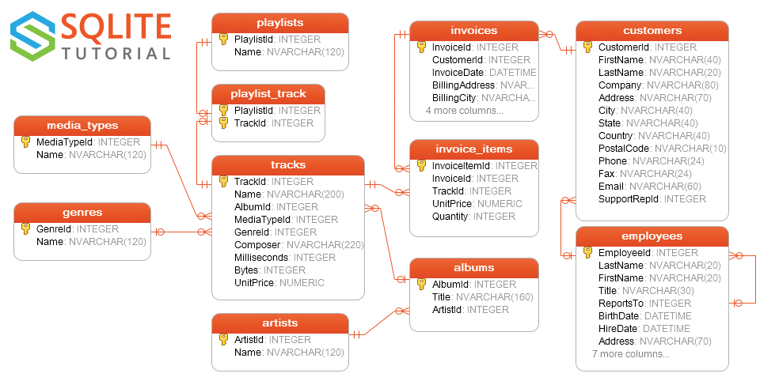

# 01 CSV 100 SQLite3

SQLite3 is a local sql database.

* Runs on the local machine
* Will NOT run on a server.  It does not support multiple simultaneous users
* There is a command-line frontend, or it may be read in clients like Heidi or the Idea database tool
* It is mainly intended to be embedded in Java applications

## Resources
* [SQLite Home Page](https://www.sqlite.org/)
* 
* [Chinook sample database](https://www.sqlitetutorial.net/sqlite-sample-database/)
  * 

## Starting CLI Client

To use the client, use the command `sqlite3` followed by the name of the database file.

`.help`

`.quit`


## Importing a .CSV file

The same general technique may be used to import .JSON or .XML.  

Start the cli interface.  Use the name of the database you want to create if it doesn't exist.

Use the following command, where the arguments are the name of the csv file and the name of the table.

## Joining tables

```
sqlite> select * from albums inner join tracks on albums.albumid = tracks.albumid order by albumid;
```