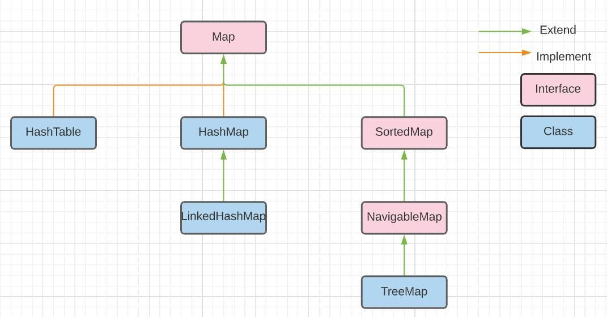

# 01.JSON.010 Maps

## Overview

Maps are not themselves a data exchange method.  But they are involved in a lot of data exchange.

In some languages Maps are called Associative Arrays.  They are arrays that are indexed by strings. 

JSON, XML, and YAML all work based on key:value pairs.  Maps are almost always involved in their processing.

## Key:Value pairs

Maps represent data in key:value pairs.  

Keys must be unique.  They are roughly similar to the primary key in a database because they must be unique.  But often they do have meaning in maps.  

In Java, Keys must be Objects.  Most commonly, they are Strings.  If you want to use numeric keys they must be "boxed" to one of the numeric "Wrapper" classes such as Double, Integer, or Long.

## The Abstract `Map` class



The Map class itself is Abstract.  This means we cannot directly create an object of Map class unless we extend it.  

We can declare variables to be of type Map, but they must be instantiated with one of their concrete child classes.  Here is an example:

```java
Map<String, Person> people = new HashMap<>(30);
```

## Digression on Hashing and Hash tables in general

* Hash codes are ideally unique.  But there is no guarantee.
* Load Factor in a hash table

## UML Diagram for the major Map Classes
From [Java Code Geeks](https://examples.javacodegeeks.com/wp-content/uploads/2019/07/javamap.jpg.webp)


### Note the methods in Map<K,V>

### The major concrete subclasses

&nbsp;|**HashMap**|**HashTable**|**TreeMap**|**Linked HashMap**
:---:|:---|:---|:---|:---
Ordered|No|No|Yes|Yes
Thread-safe|No, non-synchronized|Yes, Synchronized|No, non-synchronized|No
Ordered|No|No|Yes<br/>(Collation order of keys)|Yes<br/>(Maintains Insertion Order)
Speed| Faster than a HashTable|Slower than a HashMap|Slower than either|Faster than a TreeMap
Null keys|One null key allowed|No null key|No null key|One null key allowed
Null values|Allowed|Not Allowed|Multiple keys may have null values|Allowed
Requires<br>equals() and hashcode()|Yes|No|No (I think)|Yes

Linked Hashmaps are most useful when you need to replace the oldest occurance of an item with a newer occurance.

Reference: [https://examples.javacodegeeks.com/java-map-example/](https://examples.javacodegeeks.com/java-map-example/)