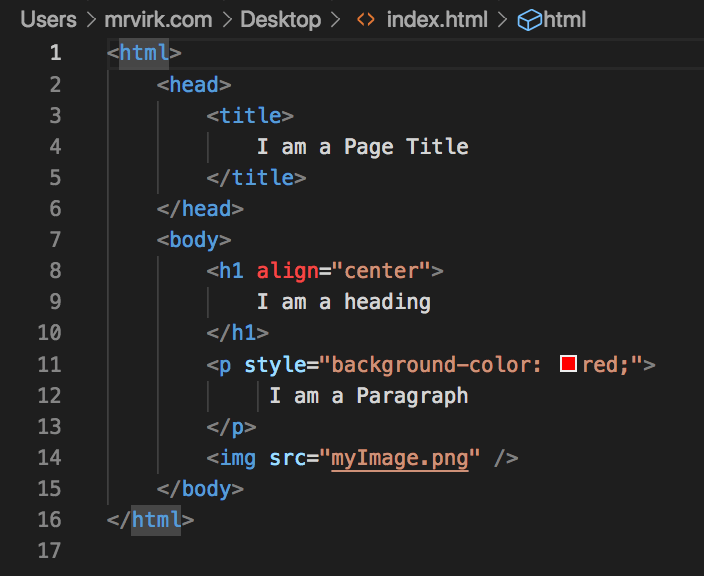
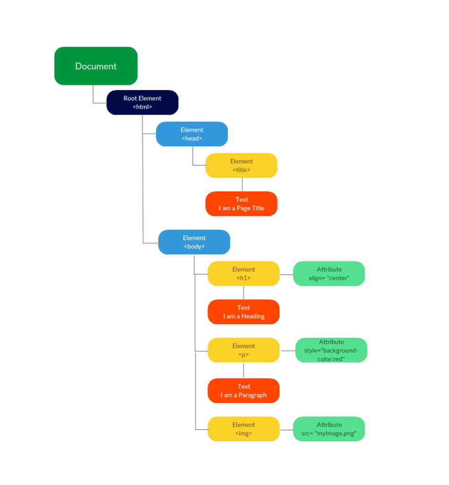

#HTML and the DOM

## HTML :arrow_right: DOM

An HTML page creates a "Document."  The document may be arranged into a tree.

Browsers work by breaking the web page into a tree and then displaying the results from the tree.

One of the amazing things about HTML5 is that the tree will always be generated in the same way, even if there are errors in coding the HTML.

### Fragment of an HTML document

Sometimes we look at only a fragment of a document, such as a table.  Even just the fragment results in a Document, and therefore a DOM.

## A DOM tree

THe following information is from [https://mrvirk.com/html-dom-diagram-and-explanation.html](https://mrvirk.com/html-dom-diagram-and-explanation.html)

Here is an HTML Document

)

## Some terms used with the DOM

[Mozilla List of Terms](https://developer.mozilla.org/en-US/docs/Web/API/Document_Object_Model/Introduction#fundamental_data_types)

* Document
* Node
* Node List
* Element  --  Based on a node.  Generally it is a node with types and other characteristics assigned to it.
* Attribute--  Example: &lt;a href="http://example.com">   In that tag, the href would be an attribute
  
## Parsing

Parsing an HTML document results in the DOM.

The [JSoup API](https://jsoup.org/apidocs/)  Browse through the different classes.  Note the return data types.  
    * Nodes are often returned
      * Trees tend to be recursive data structures.  
      *Our code does not usually need to be recursive, but it may be.  If so, it tends to be indirect recursion.  
        * I find indirect recursion easier than direct recursion 
    * Lists are pretty common.  We can generally cast those to ArrayLists.
    * Stings are very often what we want.