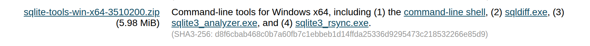

# 01.LDB.030 SQLite3

SQLite is a database designed to be used locally.  It has problems, such as not being designed for concurrent access by multiple users, but it is very easy to set up and use.  It is a great choice for small applications, such as mobile apps or desktop applications.

## Install SQLite

The SQLite home page is [https://sqlite.org/](https://sqlite.org/).  We will be using SQLite3, which is the current version of SQLite at the time I am writing this.

### Linux

On Linux, you can install SQLite3 using your package manager.  For example, on Ubuntu or Debian, you can use the following command:

```bash
sudo apt-get install sqlite3
```
On Fedora, you can use the following command:

```bash
sudo dnf install sqlite3
```

If, by the way, you use ARCH, you are obviously a superior human being, and you can figure it out yourself.

### Windows

On Windows, you can download the precompiled binaries from the SQLite website.  Go to [https://sqlite.org/download.html](https://sqlite.org/download.html) and download the "sqlite-tools-win32-x86-xxxxxx.zip" file.  Extract the contents of the zip file to a directory of your choice, and add that directory to your PATH environment variable.



## Get the sample "Chinook" database

Download the the Chinook sample database from [https://www.sqlitetutorial.net/sqlite-sample-database/](https://www.sqlitetutorial.net/sqlite-sample-database/).  Save the file `Chinook_Sqlite.sqlite` to a directory of your choice.

The diagram of the database is


There is also a nice set of short tutorials on this page.

## Using SQLite3

At the command line, start sqlite with the name of the database file.  If you are in the same directory as the file, you can just use the file name.  Otherwise, you will need to provide the full path to the file.

```bash
sqlite3 Chinook
```

Some basic commands:

* .quit - exit sqlite
* .tables - list the tables in the database
* select * from employees; - run a SQL query
* .schema [table name] - show the schema for the specified table, or for all