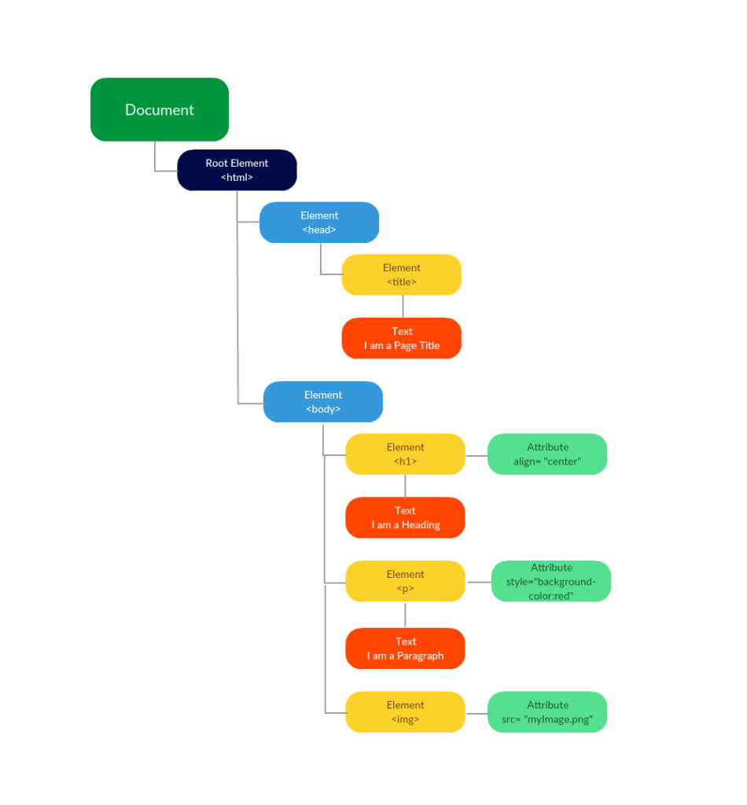

# 01 XML 060 Creating XML Files.

&nbsp;|&nbsp;
:---|:---:
The root for our tree has a Document as its super-root  The Document is called the `DOM` that stands for the Document Object Model.  It is a tree that represents an HTML or an XML document|

