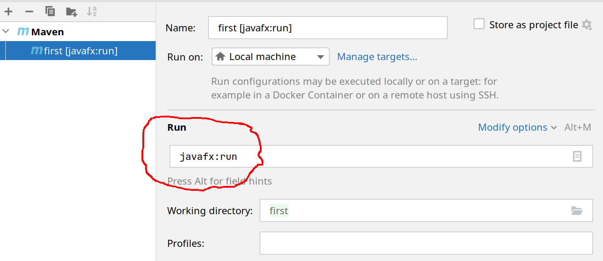
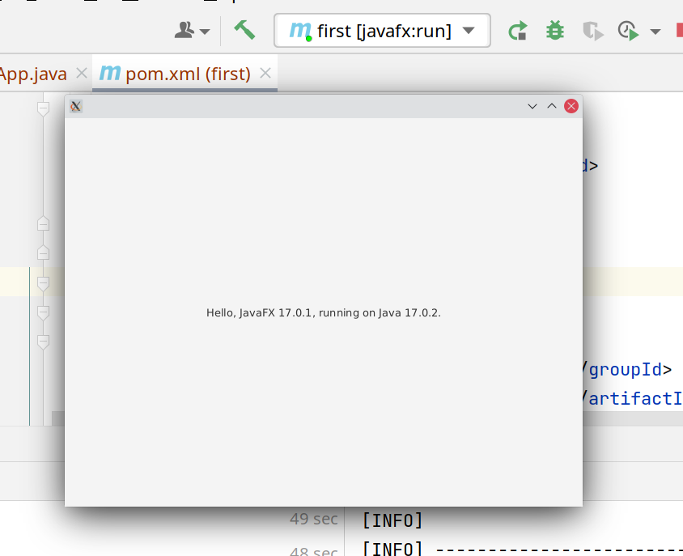

# 02.100 JavaFX Getting Started

[Link to companion video](https://mwsu.hosted.panopto.com/Panopto/Pages/Viewer.aspx?id=762cfa3e-05f2-4489-8156-ae760080712f)

[Link to Aaron Grant's useful video](https://www.youtube.com/watch?v=ZfaPMLdgJxQ)

[Passing information between controllers](https://stackoverflow.com/questions/14187963/passing-parameters-javafx-fxml)
## Java Version

You must have Java 11 or later for JavaFX in its modern form.  There was a version starting with Java 9.  I am using Java 17 in this tutorial.

## Setting up Intellij

Your must also have JavaFX enabled in IntelliJ.

See [https://www.jetbrains.com/help/idea/javafx.html#create-project](https://www.jetbrains.com/help/idea/javafx.html#create-project) for details.  Basically:

1. If you have a project open, you should be able to Open the "Files go to Settings or Preferences.  If no project is open, then use Ctrl+Alt+S to open the same dialog.
2. Select the "Plugins" option
3. Select the "Installed" tab.
4. At this point the IntelliJ documentation appears a little out-of-date.
   * You may need to search for "Javafx" in the search box.
   * At a minimum, select "JavaFX Runtime for Plugins" by JetBrains.
   * On Linux, I have the following selected.  It may vary a bit if you are using Windows or a Mac.
     * JavaFX Helper
     * JavaFX Tools
     * FXMLHelper
     * Dukescript Java Regex Tester -- This is totally unrelated to JavaFX.  But it looks like it could be very handy.  I am trying it out.  If it looks like I was trying to force Regex into a future assignment, it probably means I was playing with this plugin.  I love a good regex.

## Adding JavaFX

JavaFX is no longer always loaded in Java.  

Adapted from [https://openjfx.io/openjfx-docs/#maven](https://openjfx.io/openjfx-docs/#maven)

```bash
mvn archetype:generate \
        -DarchetypeGroupId=org.openjfx \
        -DarchetypeArtifactId=javafx-archetype-simple \
        -DarchetypeVersion=0.0.3 \
        -DgroupId="" \
        -DartifactId=first \
        -Dversion=1.0.0 \
        -Djavafx-version=17.0.1
```        
The above works in Linux.  It will probably work on a Mac as well.  The \ symbols mean the line is continued.  (Speculation follows:)  In Windows I think the ^ is used for line continuation.  So it should be possible to change them.  I tried faking this, but it has not been tested yet.  I also made a option 2 which is everything on one line.

```bash
mvn archetype:generate ^
        -DarchetypeGroupId=org.openjfx ^
        -DarchetypeArtifactId=javafx-archetype-simple ^
        -DarchetypeVersion=0.0.3 ^
        -DgroupId="" ^
        -DartifactId=first ^
        -Dversion=1.0.0 ^
        -Djavafx-version=17.0.1
```
One-liner.  Also has a different name:
```bash
mvn archetype:generate -DarchetypeGroupId=org.openjfx        -DarchetypeArtifactId=javafx-archetype-simple -DarchetypeVersion=0.0.3 -DgroupId="" -DartifactId=first -Dversion=1.0.0 -Djavafx-version=17.0.1
```     


```xml
    <plugin>
        <groupId>org.openjfx</groupId>
        <artifactId>javafx-maven-plugin</artifactId>
        <version>0.0.8</version>
        <configuration>
            <mainClass>HelloFX</mainClass>
        </configuration>
    </plugin>
```

## Runtime Configuraton

As usual, Intellij will not have a run configuration by default.  You can get the IDE to build a run configuration by going to the Run menu and then clicking on Run that appears about a third of the way down the list.

The problem is that between JavaFX, Maven, and IntelliJ the source code does not always get recompiled when you modify your code.  

### Manual "clean"

If your changes seem to have no effect, open the "Maven" panel from the right edge of Idea.  Open the "Lifecycle" item and click "Clean."  Then your program will recompile everything.  This is a pretty brute-force approach, but it works for small to medium sized projects on a reasonably powerful computer.

### Automating the clean process

Open the Maven controls.  Open Lifecycle.  Right click on Clean.  Click on "Execute before Run/Debug."  This should put a (Before run) next to Clean. 

Now all the files will be recompilled befor a run.  This isn't always ideal if you have a large project.  But for small projects it works fine.

### Manual setup. 

The following is an older way of setting this up.  I didn't delete it because it still does have some useful information.

I needed to add a runtime configuration. I picked a Maven configuration. All I added was on the "Run" line.  One of the options was javafx:run.  I picked that as a guess.  It worked.



I was rewarded with the following javafx app: 


