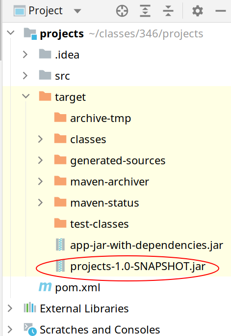
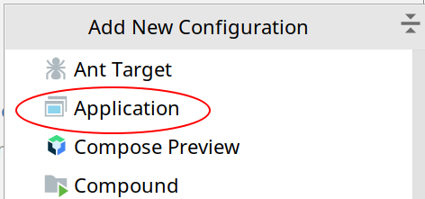
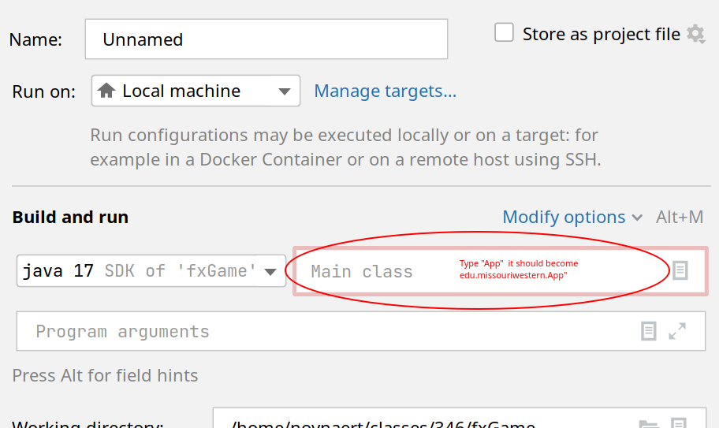
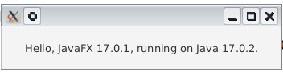

# 02.120 Building a JavaFX App (with a package)

This example will build an JavaFX program based on the game we developed earlier.

## Getting the jar of your monsters

The first thing you will need to do is make sure GameManager is not `final`.  You will need to rebuild the project.

Find the File|Making the file
:---:|---
| Depending on what archetype you used, you may need to open the Maven flyout and run "package."
You should see something that has your project name followed by -1.0-SNAPSHOT.jar|If you don't find it, the jar file may be created at the command line.

## Create the project at the command line.

```bash
mvn archetype:generate -DarchetypeGroupId=org.openjfx        -DarchetypeArtifactId=javafx-archetype-simple -DarchetypeVersion=0.0.3 -DgroupId="" -DartifactId=fxGame -Dversion=1.0.0 -Djavafx-version=17.0.1
```     
I already named this "fxGame" in the above command.  You may change that if you with.  

### Open the project folder

Run IDEA, if necessary.  Open the project you just created.

Set up a run configuration.  I used a simplified version of the method Devin suggested.

Picture|words
:---:|:---
 |Add a new run configuration
 |Pick the "Application" configuration
 | Find the area with "Main Class."  Type "App." It should expand with your group id. <br><br> The default configuration is "unnamed."  Change it to something more satifying if you want to.  I used "Run Game"
 | Run your game.  Your window may look a little different if you are not on Linux.  I also reduced the size.

