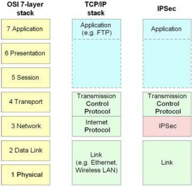

# 02.202 Restful APIs

## Restful API

I think of the Restful API system as the 6th layer of the 5-layer model.

## ReST

ReST stands for "Representational State Transfer"  It is a system for exchanging data between systems.  It is also used for passing information between parts of an internal software system.

## Frameworks

Frameworks are patterns used to standardize the development of large software projects.  One way to look at frameworks is that they are a way of producing Restful APIs.  Some frameworks also integrate methods for consuming APIs as clients.

Frameworks are available in most major programming languages.  

* Python -- Flask and Django
* PHP -- Laravel
* Java -- Spring

Frameworks generally restrict programmers by giving all programs a similar structure.  They are based around concepts like Dependency Injection and the use of Controllers.

## Spring and Spring Boot

Spring is the dominant framework for Java.  Spring has a reputation of being hard to configure and set up.

Spring Boot is a system that simplifies setting up Spring projects.

One aspect of a Spring project is a Maven file that includes a lot of standard APIs.